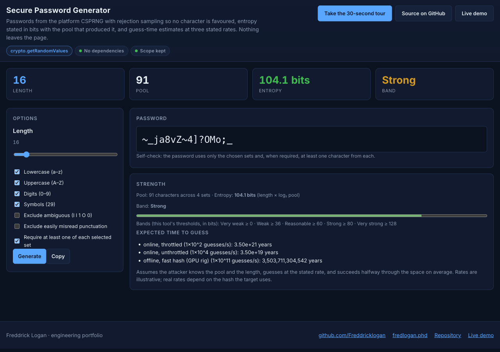
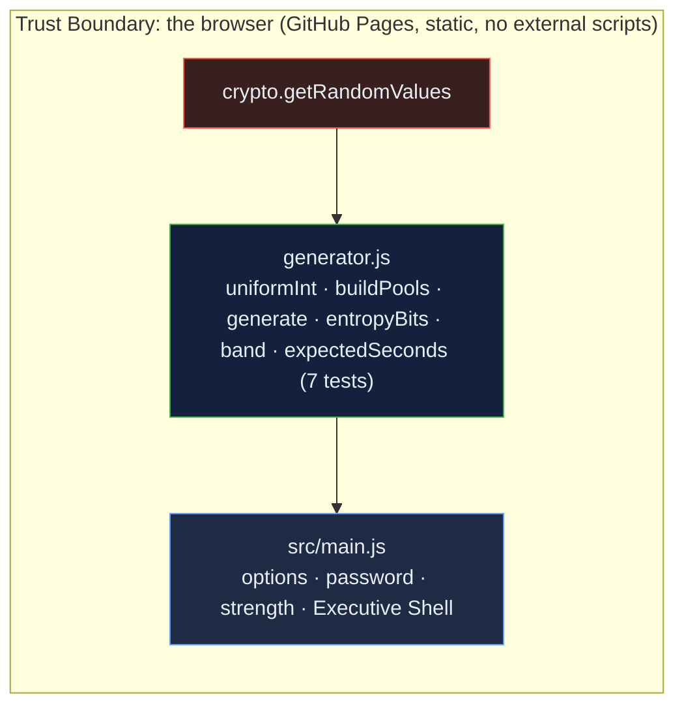

# Secure Password Generator: CSPRNG with rejection sampling, entropy in bits, and a strength scale that says what it is

[](https://github.com/Freddricklogan/secure-password-generator/actions/workflows/deploy.yml)
[](#5-getting-started--verification)
[](https://github.com/Freddricklogan/secure-password-generator/actions/workflows/codeql.yml)
[](LICENSE)
[](https://freddricklogan.github.io/secure-password-generator/)

## 1. Executive Summary & Business Impact

**Problem statement.** Password generators are judged on two things:
whether every character is equally likely, and whether the "strength"
they report means anything. The previous build got the first mostly
right — `crypto.getRandomValues` with rejection sampling — but carried
a signed-shift bug in the sampler, an unused `Math.random` helper, and
a strength score out of 100 assembled from entropy and invented
bonuses (`AUDIT.md`).

**Solution & value delivered.** The same options, kept to scope, on a
sampler that uses unsigned arithmetic and rejects biased bytes (with a
chi-squared flatness test in the suite), a shuffle that never trims a
guaranteed character, entropy stated in bits with the formula and the
pool size that produced it, bands labelled as this tool's own
thresholds, and expected guess times at three named rates with the
assumption printed. No dependencies; nothing leaves the page.

**[→ Read the full case study](docs/CASE_STUDY.md)**



## 2. Demonstrated Competencies & Technical Skills

- **Cybersecurity** — CSPRNG use, modulo-bias avoidance by rejection
  sampling, entropy arithmetic, guess-rate reasoning with stated
  assumptions, strict CSP.
- **Statistics** — chi-squared test of sampler flatness in the test
  suite.
- **Engineering Practice** — injected byte source for deterministic
  tests, conformance checks across option combinations, no external
  scripts.

## 3. System Architecture & Data Flow



## 4. Technical Highlights & Engineering Decisions

### ADR-1 — Rejection sampling over whole bytes, unsigned

**Context.** `x % n` over a byte is biased unless 256 is a multiple of
`n`; the old sampler rejected correctly but accumulated with a signed
shift.

**Decision.** `uniformInt(n)` draws ⌈log₂ n / 8⌉ bytes, accumulates
with multiplication, rejects values at or above the largest multiple of
`n`, and returns the remainder. Tests pin the rejection boundary for
`n = 10` (bytes 250–255 rejected), the two-byte case, and `2³² − 1`
from four `0xFF` bytes.

**Consequence.** A chi-squared statistic over 26,000 draws into 26
buckets stays under the 99.9th percentile in the suite.

### ADR-2 — Entropy with its inputs shown

**Context.** A score out of 100 with bonuses cannot be checked.

**Decision.** Show `length × log₂(pool)` with the pool size; label the
bands as this tool's thresholds; give expected guess time at three
named rates assuming the attacker knows the pool and length.

**Consequence.** A reader can recompute every number on the page.

### ADR-3 — Inject the byte source

**Context.** A generator that only reads the platform CSPRNG cannot be
tested for determinism.

**Decision.** Every function takes a `bytes(n)` argument defaulting to
`crypto.getRandomValues`; tests pass sequences and assert exact
outputs.

**Consequence.** Generation, shuffling and the guaranteed-character rule
are tested exactly, not statistically.

## 5. Getting Started & Verification

**Prerequisites.** Node 22 LTS. No build step; the page is served from
the repository root.

```bash
git clone https://github.com/Freddricklogan/secure-password-generator.git
cd secure-password-generator
npm ci
npm run lint && npm run validate && npm run coverage
npx serve .    # open http://localhost:3000
```

**Verification — the numbers this repository actually produced:**

```bash
npm run coverage   # 7 passed / 7; All files 96.42% stmts, 91.54% branches
npm run lint       # 0 problems
npm run validate   # html-validate index.html: clean
```

| Check | Result |
| --- | --- |
| Unit tests (Vitest) | **7 passed / 7** |
| Coverage (logic module) | **96.42%** statements, **91.54%** branches (two unreachable fall-through returns uncovered; `main.js`, `ui.js` covered by the browser smoke test) |
| ESLint, html-validate | clean |
| Sampler flatness | chi-squared over 26,000 draws into 26 buckets < 52 (25 d.f.) |
| Headless Chrome smoke | **0 console errors**; defaults → 16 characters from a 91-character pool, 104.1 bits, "Strong", self-check passes; lowercase only → 26-character pool, 75.2 bits, "Reasonable", `^[a-z]{16}$`; no sets → error shown and Generate disabled; exclude ambiguous → 86-character pool and none of `Il1O0` present; length 64 → 411.3 bits, "Very strong"; three tour steps; no horizontal scroll at 1280 or 400 px |

## 6. Live Demo & Production Showcase

**<https://freddricklogan.github.io/secure-password-generator/>**

**30-second guided walkthrough.** Press **Take the 30-second tour**: it
explains the sampler, changes the length to show the entropy move, and
points at the guess-time estimates.
